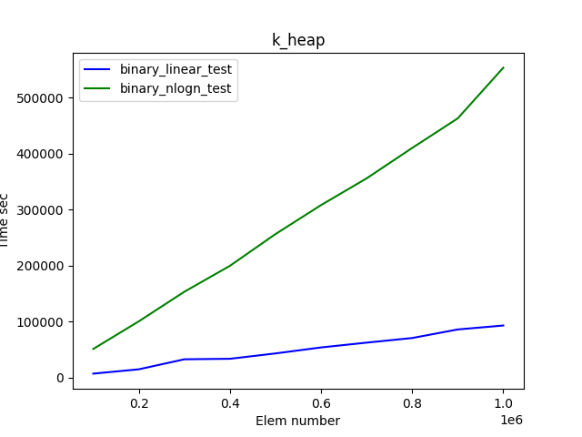

# Lab 4 Heaps
### MIPT Algorythms course work report

## Done
1. Implemented k-heap based on dynamic array.
2. Implemented binomial heap.
3. Compared two different k-heap build methods.
4. Compared k-heap linear build and binomial heap build performance.
5. Made theoretical report and conclusion.

## Run tests instruction
1. Download or copy [repository](https://github.com/SeveraTheDuck/AlgorithmTasksMIPT/tree/lab4-Heaps).
2. Open terminal in lab4-Heaps folder.
3. To make tests input, run `make maketests` command via terminal.
4. To run tests, run `make run_all_tests` command via terminal.
5. To make plots, run `make makeplots` command via terminal.
6. Done :3

## Report

1. **K-heap implementation details**
K-heap is implemented using dynamic array structure, which supports push/pop operations and index requests. It uses `void*` type for array and fills it with pointers to the heap keys.
We compared two different k-heap build strategies: one with $\mathcal{O}(n)$ and the other with $\mathcal{O}(n\log n)$ time complexity.
1.1 First build strategy is based on usual insert operations. Since it can be $\mathcal{O}(\log n)$ in worst case, total time complexity is $\mathcal{O}(n\log n)$.
1.2 Second strategy uses following statement: since subtrees without children are already ordered, we can use SiftDown operations from $\frac{n}{2}$ to $0$ to build heap in place.
> LEMMA
Algorytm's time complexity is $\mathcal{O}(n)$
Total time is not greater then $$S = \sum_{h=1}^H \frac{n}{2^h}\cdot 2 \cdot h = n \cdot 2 \sum_{h=1}^H \frac{h}{2^h} = 2n \cdot \sum_{h=1}^{H} (\frac{1}{2}\cdot \frac{h - 1}{2^{h - 1}} + \frac{1}{2^h})$$
For $H \xrightarrow[]{}\infty$ we get:
$$s = \sum_{h=1}^{\infty} (\frac{1}{2}\cdot \frac{h - 1}{2^{h - 1}} + \frac{1}{2^h}) = \frac{s}{2} + 1$$
Which means, $S \le 4\cdot n = \mathcal{O}(n)$

2. **Binomial heap implementation details**
Binomial heap is made using less strict structure than k-heap has, but it has more memory transitions, which affects its constant in time complexity.
We use *binomial tree* - a tree which, for each $k = 0, 1, 2,...$, can be defined as: $B_0$ - a tree with one vertex; $B_k$ consists of two $B_{k-1}$ trees such as the root of one of them is a child for the root of the second tree.
*Binomial heap* is a set of binomial trees with following features:
2.1 Every tree is ordered as a k-heap in non-decreasing order.
2.2 For each $k$ there is no more than one binomial tree.
Build strategy is based on regular inserts.
> LEMMA
Build strategy time complexity is $\mathcal{O}(n)$.
Let us make a potential function $\phi(n)$ which stands for the number of 1 in binary representation of $n$.
If we have $k$ 1 in the end of the representation during $i$-th insertion, the operation time complexity $t_i = k$ and $\phi_{i} - \phi_{i - 1} = -k + 1$. If we have $0$ in the end of the representation, $t_i = \Delta\phi_i = 1$.
So for amortized $a_i = t_i + \phi_{i} - \phi_{i - 1} = 1$ or $2$ = $\mathcal{O}(1)$.
Which means the total time complexity is $\mathcal{O}(n)$.

3. **K-heap build methods comparison**
<figure>

</figure>

4. **K-heap linear build vs binomial heap build**
<figure>

</figure>

5. **Conclusion**
Despite the fact that k-heap is implemented with `void*` type, which means a lot of allocations and memory copying functions, and binomial heap is implemented with `int` type, k-heap linear build is around $3$ times faster than binomial heap.
Still, binomial heap shows twice better performance than k-heap $\mathcal{O}(n\log n)$ build strategy.
This lab work shows us that binary heap is the best variant for most of occasions (sadly, no fibonacci heap with Dijkstra algorithm), but binomial heap may be used when there is no option to build the heap in-place, insert-only. 

## References
1. [Our course presentations](https://drive.google.com/drive/folders/1Y7ywB90fZlR-hQpyNM1d38aT1kOBY4YM).
2. [ITMO wiki](https://neerc.ifmo.ru/wiki/index.php?title=%D0%91%D0%B8%D0%BD%D0%BE%D0%BC%D0%B8%D0%B0%D0%BB%D1%8C%D0%BD%D0%B0%D1%8F_%D0%BA%D1%83%D1%87%D0%B0)
